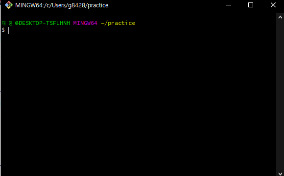
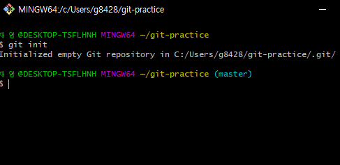
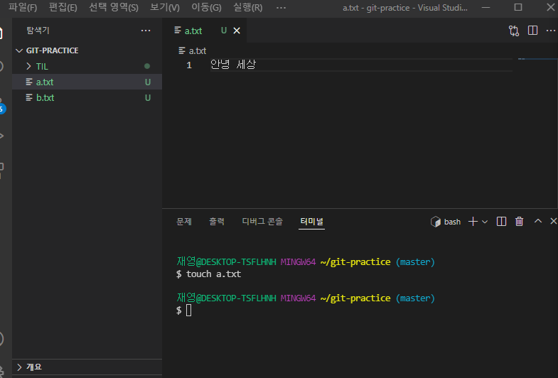
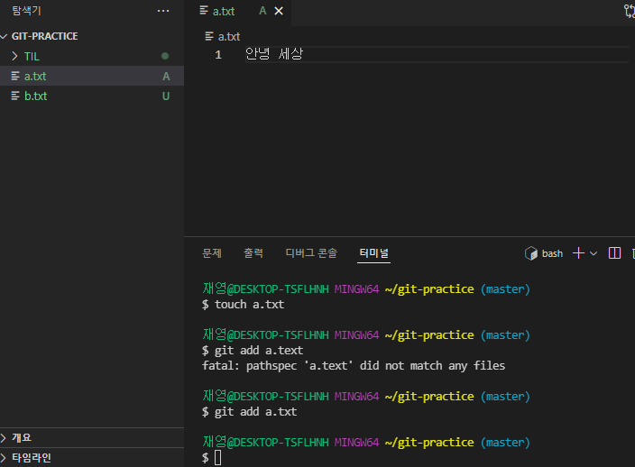

## 마크업

> 노션이랑 비슷
>
> > 인용문작성
> >
> > > 인용문작성은 '>', 하위인용문은 '>>' 

- 마크다운 확장명은 .md
- 깃허브에 올릴 때 README.md 형태로 올려서 대문 텍스트로 

- 마크다운 쓰는 이유
  - HTML, XML로 태그 지정해서 쓰던 거
  - 텍스트 기반으로 쉽게 쓸 수 있게 됨

##  

### 개요 제목 2

- 제목 쓰는 건 단순히 크기 키우려고 하면 안됨
- 개요에 트리형으로 저장되기 때문에 꼬인다


# 제목 1

## 제목 2

### 제목 3

#### 제목 4

##### 제목 5

###### 제목 6

> #을 통해서 제목 지정
>
> Ctrl + / 를 하면 원래 작성한 내용 볼 수 있음

---

# 목록

- -하나 치면 됨
  - 탭치면 하위
    - -,*,+ 활용

1. 순서있는 목록
   1. 똑같이 탭치면 하위
   2. (1. 2. 3. ) 등등

<참고>

tab : 들여쓰기

shift + tab : 내어쓰기

문자열 이스케이핑 : 백슬래시(\를 앞에 써주기)

- 명령어 취급 안하고 문자 그대로 쓰기

# 강조


- 굵게 : **글자** 또는 ctrl + B
- 기울임 : *글자* 또는 ctrl + i
- 취소선 : ~~글자~~ 또는 alt + shift  + 5
- 밑줄 : <u>글자</u> 또는 ctrl + U


# 코드블록


- 인라인 코드 : `hello world` (`` ) 
- 블록 코드 : (```언어이름)

```python
def get_block(```):
    return 'hello world'
```

```bash
mkdir TIL
cd TIL
touch todayIlearn.mk
```


# 링크

- \[표시할 글자](url) 형태로 작성

- [git 특강 노션 위치](https://hphk.notion.site/hphk/Git-1-_A-22-02-09-22-02-11-3f4afeb98f784b7ead4a82f5aebd86de)

- 클릭할 땐 Ctrl click


# 이미지

- 환경설정 통해서 복사 붙여넣기 설정
- 화면캡처 : 윈도우 + shift + s
- 

- 또는 \!\[표시할 글자](이미지url)


# 인용

> \> 를 써서 인용문 표현
>
> > 한번 더 쓰면 중첩인용문


# 표

- 파이프(|), 하이픈(---) 으로 만들 수 있으나 불편
- 본문 - 표 - 표삽입 (ctrl - t)

| 하나                            | 둘   |
| ------------------------------- | ---- |
| 행 추가는 ctrl + enter          | 셋   |
| 삭제는 ctrl + shift + backspace |      |


# 수평선

- 구분선 \---, \***, \___

---

***


# 실습

# Python


## 1. 개요


파이썬(Python)은 1990년 암스테르담의 귀도 반 로섬(Guido Van Rossum)이 개발한 인터프리터 언어이다. 귀도는 파이썬이라는 이름을 자신이 좋아하는 코미디 쇼인 "몬티 파이썬의 날아다니는 서커스(Monty Python’s Flying Circus)"에서 따왔다고 한다.

> 인터프리터 언어란 한 줄씩 소스 코드를 해석해서 그때그때 실행해 결과를 바로 확인할 수 있는 언어이다.


## 2. 특징

1. **파이썬은 인간다운 언어이다. 아래 코드는 쉽게 해석된다.**

​		`if 4 in [1,2,3,4]: print("4가 있습니다")`

​		*만약 4가 1, 2, 3, 4 중에 있으면 "4가 있습니다"를 출력한다.* 라고 말이다.


2. **파이썬은 간결하다.**

   ```python
   # simple.py
   languages = ['python', 'perl', 'c', 'java']
   
   for lang in languages:
   	if lang in ['python', 'perl']:
   		print("%6s need interpreter" % lang)
   	elif lang in ['c', 'java']:
   		print("%6s need compiler" % lang)
   	else:
   		print("should not reach here")
   ```


3. **공식문서가 자세히 제공된다.**

​		[파이썬 공식문서 링크]( https://docs.python.org/3/)

---


# 깃 기초

- CLI / GUI / markdown
  - git 설치 완료 bash, gui, cmd
  - vscode 설치 완료

> **깃은 버전 관리 프로그램**

   - 설치만 했다고 해서 바로 버전 관리가 이루어지지 않음
   - 명령을 내려줘야 한다

1. **Git bash 실행**

   

   

> ~ 는 홈폴더, practice 는 하위 폴더

2. **폴더 관리 명령**



​			`git init`

> git init을 통해 관리명령, (master)가 뜬다
>
> ls -a 를 쓰면 숨김파일 포함 모든 파일 목록을 보여준다

 - **깃은 최신 파일과 모든 변경 내용 파일을 저장한다**

   

3. **파일 커밋 업데이트**

> 깃의 구조
>
> working directory > **staging area** > commits
>
> 변경파일을 저장하기 위해 **새 공간**으로 이동한다

> working directory >
>
> **git add file.txt** > 
>
> staging area > 
>
> **git commit -m '메시지'** > 
>
> commits(local repository)

​	1. vs 코드로 파일 생성 및 터미널 연결



2. Staging Area로 add

   `git add 파일`
   
   

> file 상태 확인 - git status

3. commit 전송

   `git commit -m '저장할 이름'`

​		`git log` *git 정보들 열람*  q누르면 exit

​		`git log --oneline` 간단하게 보기

