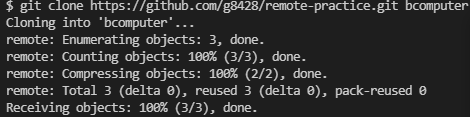
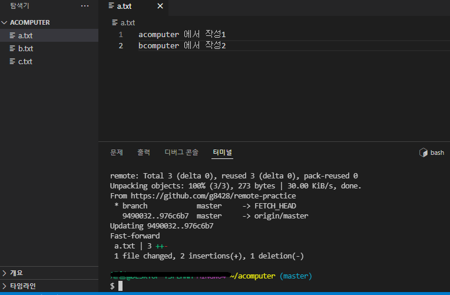
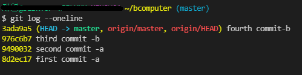
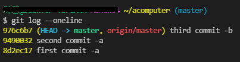
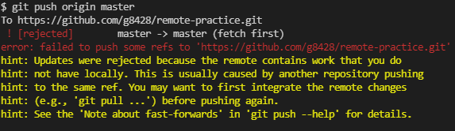
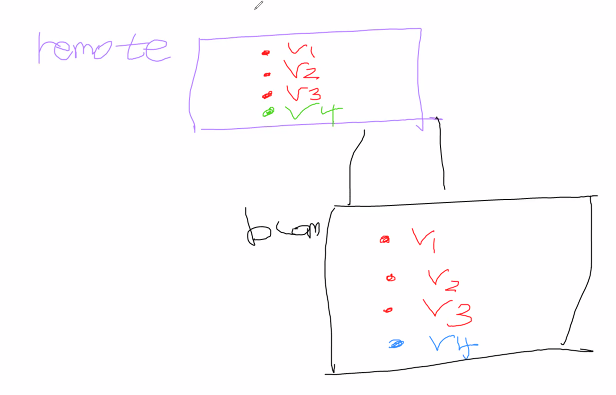
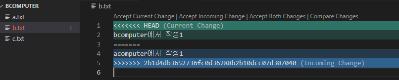

# 목표

1. **Git Repository 관리, push**

2. .**gitignore**
3.  **clone , pull**

## 1. Git Repository 관리
- 지난 시간에 git init으로 로컬 작업공간을 지정했다
- 문서 내 파일을 git add '파일'과 git commit -m '이름'으로 로컬공간 커밋을 했다
- 해당 커밋내역을 Github에 push하는 법을 배운다
### 사전과정
- 깃 로컬에 user.name, user.email 추가
- 깃 허브에 TIL 레퍼지토리 생성, master 지정
### 이후과정
- 깃허브 대문 README.md 파일 생성
- 깃허브 주소 origin 추가
    - `git remote add origin https://github.com/g8428/TIL.git`

    - origin 확인 `git remote -v`
- 깃허브 remote공간과 깃 local공간이 연결되었다
- commit 내역 remote 공간에 push
`git push origin master`

# 2. gitignore

- git 커밋에서 예외를 두고 싶을 때

- 파일이 많아지면 일일이 git add '파일명' 할 수 없다
  - 그래서 git add . 을 쓰는데 그러면 모든 파일이 관리된다
  - `touch .gitignore`  > gitignore 텍스트 파일 하나 생긴다
    - gitignore 텍스트 파일 내 파일명을 입력
    - 해당 파일은 관리대상에서 제외

**gitignore 파일은 꼭 .git 파일과 같은 위치에 있어야 작동**

**이미 add해서 버전 관리가 된 대상은 ignore에 추가해도 제외 불가**

---

**!** [gitignore.io](https://www.toptal.com/developers/gitignore)

작업상황에 맞게 gitignore 내역 만들어주는 사이트

---

## 3. clone , pull

- 기존 방식은 remote push 상향식,  local에서 remote로 보내야 함
- 허브에 있는 repository의 clone을 가져와서 local로 만드는 하향식 방법

`git clone URL주소 만들클론이름`

- local 내에서 버전을 여러군데 보관할 수 있게 됨
  - clone repository가 여러개 생기므로

**클론을 뜰 땐 홈폴더에서 하는게 관리가 쉽다**

- 허브 - code - url copy

  
  
  


- 허브에서 clone으로 pull 당겨오기

  `git pull origin master`
  
  

​	**bcomputer에서 push를 했음에도 클론과 로컬 작업물이 같지 않다.**

```bash
#~/bcomputer(클론/원격)
git push origin master
```





`git log --oneline`을 찍어보면 두 컴퓨터의 커밋이 같지 않음을 알 수 있다






**때문에 git pull 을 해서 깃허브 리포지토리에서 커밋을 당겨오면 됨**

```bash
# ~/acomputer(로컬)
git pull origin master
```


- 만약 로컬에서 수정하고 push 했는데 클론에서 같은 라인에 다른 내용으로 push를 한다면 충돌 오류가 뜬다

  



- 같은 버전의 커밋인데 다른 내용이 되어 버리는 것
- 같은 원리로 깃허브 자체에서 뭔가 바꿔도 충돌

- github에서 먼저 pull을 해와야 한다

  ```bash
  # ~/bcomputer
  git pull origin master
  ```

  


선택 

- Accept Current Change 현재 변경점만 적용

- Accept incoming Change 기존 변경점만 적용

- Accept Both Changes 두 변경점 모두 적용

- Compare Changes 두 변경점 비교

  ```bash
  ~/bcomputer (master|MERGING)
  ```


*master|MERGING 으로 branch 바뀜 **아직 충돌 끝난 거 아님!*** 

- 아직 합쳐지지 않았으니 add , commit 새로 올리기