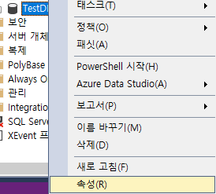
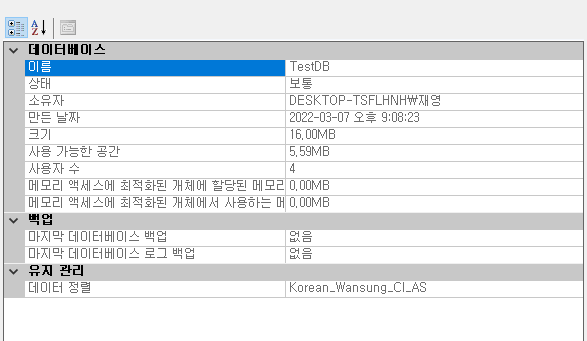
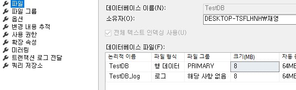
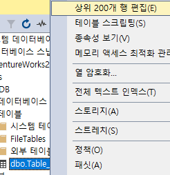

# SQL 문법

## 조인(Join) / 디비전(Division)

- 어려움, 확실히 이해하고 넘어갈 것

### 조인

---

- 조인 연산은 두 테이블을 **연결**하여 새로운 데이터 표로 생성
- 여러 종류의 조인이 있다

| 상품코드(기본키) | 과일 | 가격 |
| ---------------- | ---- | ---- |
| 1                | 수박 | 500  |
| 2                | 참외 | 200  |
| 3                | 귤   | 300  |

| 매출일자 | 상품코드(외래키) | 판매수량 | 판매처 |
| -------- | ---------------- | -------- | ------ |
| 12/1     | 3                | 10       | D마트  |
| 12/2     | 2                | 10       | A마트  |
| 12/3     | 1                | 10       | H마트  |

> 두 테이블을 조인해서 새로운 테이블(중복키는 하나로(기본-외래키))

| 매출일자 | 상품코드 | 상품명 | 가격 | 판매수량 | 판매처 |
| -------- | -------- | ------ | ---- | -------- | ------ |
| 12/1     | 3        | 귤     | 300  | 10       | D마트  |
| 12/2     | 2        | 참외   | 200  | 10       | A마트  |
| 12/3     | 1        | 수박   | 500  | 10       | H마트  |

### 디비전

---

- 디비전 연산은 두 테이블의 **특별한 포함관계**를 통해 자료를 추출해내는 연산

| 판매처코드 | 판매처명 | 판매일자 |
| ---------- | -------- | -------- |
| 1011       | M마트    | 12/15    |
| 1011       | M마트    | 12/10    |
| 2033       | A마트    | 12/15    |
| 2055       | L마트    | 12/22    |
| 3001       | S마트    | 12/27    |

<판매처테이블>

| 판매처코드 | 판매처명 |
| ---------- | -------- |
| 1011       | M마트    |
| 2033       | A마트    |

<디비전>

| 판매일자 |
| -------- |
| 12/15    |
| 12/10    |

> 해당 밸류들을 갖고있는 레코드의 다른 열 값
>
> 디비전 = 나누기
>
> - 본테이블에 판매처테이블을 나누려면 값이 존재하는 레코드만 나눌 수 있다
>     - 특별한 포함관계 = 분자테이블에는 분모테이블(나누려는)의 값을 모두 포함해야 한다
> - 나눈 나머지를 반환한다

# 데이터베이스 만들기 1

- 데이터 베이스 만드는 방법

    1. 개체  탐색기에서 생성

    .assets/image-20220307205753419.png)

    - 여러 옵션들을 알고 있어야 함

    

    2. 직접 CREATE DATABASE 문으로 생성

### 데이터베이스 생성

- 데이터베이스 이름 설정
    - .assets/image-20220307205932587.png)
    - 이름은 임의로 설정
    - 대소문자 상관없고 _ 포함 가능
    - 논리적이름에 동일하게 생성 됨
    - 테이블 하나만 만들어도 _log 파일도 같이 생성됨
- 소유자 : 데이터베이스 만드는 계정
- .mdf  ( 테이블 형 데이터 확장자 )
- *_log.ldf ( 로그 데이터 확장자 )
- 파일 그룹
    - 기본적으로 mdf파일의 PRIMARY 파일 그룹
- 처음크기
    - 생성시 만들어지는 데이터 파일과 로그파일의 크기 설정
    - 사용할 DB의 목적과 규모를 생각해서 설정. 단위는 MB
- 자동증가 / 최대크기
    - DB를 쓰다 용량이 꽉 찼을 때 자동증가 시킬지 / 자동시 성능 저하 가능성
    - 수동으로 증설도 가능 ...버튼 눌러 설정
    - 증가 단위는 백분율 또는 MB
    - 최대파일크기도 무제한 설정 가능(제한도 가능)
- 경로
    - 기본값은 SQL Server 설치폴더의 DATA 폴더
    - `D:\Program Files\Microsoft SQL Server\MSSQL13.MSSQLSERVER\MSSQL\DATA`
    - 데이터파일, 로그파일 경로를 다르게 지정 가능(성능, 안정성 고려하여)

### 데이터베이스 생성

- 속성 - 파일로 들어가면 DB 데이터 옵션을 다시 설정할 수 있다.

## Table 만들기

- 개체탐색기, 또는 명령문을 사용해서 생성 가능
- 테이블은 캐비닛 안 서랍장 한칸, 그 안에 구역을 나눠 동일한 유형의 정보를 담기(열)
- 테이블을 만든다는 건
    - 열 이름과, 들어갈 정보의 유형을 결정하는 것
    - 들어갈 제약 조건을 결정하는 것 (데이터 타입, 형식,조건) **조건 설정 중요**

## SQL Server 데이터 형식

1. 수치형(정수/실수)
    - bigint(8), int(4), smallint(2), tinyint(1byte = 0~255) / float, real
2. 날짜형(날짜, 시간)
    - date, time, datetime, smalldatetime, datetime2, datetimeoffset
3. 문자열(기본문자열/유니코드문자열/이진문자열)
    - char, varchar, text / nchar, nvarchar, ntext
        - character, variable character(가변적인 문자/변수)
            - char(10) 등으로 제약 걸 수 있음 = (10글자 이내)
            - 한글은 한 자당 2개씩 차지=5글자
            - nchar(10)은 유니코드(한글기준)라 한글 10글자 가능
        - 유니코드는 한글
    - / binary, varbinary, image

### 테이블 생성

.assets/image-20220307212342137.png) 

.assets/image-20220307212422038.png) 

- 테이블 생성 후 테이블 편집

-  

- char(10)에서 10자 이상 입력했을때 ( 입력은 Tab )

    .assets/image-20220307212655409.png)

    

### Char 와 varchar의 차이점

- #### char(n)

    - variable이 없다는 것은 고정적이라는 의미
    - n의 범위라면 입력되지 않고 남은 공간은 공백으로 처리된다.
    - 처음 선언된 모든 범위가 사용된다. 고정된 길이의 문자를 쓰면 좋다(ex: 주민번호)
    - 입력값이 짧다면 공간낭비 / n바이트의 저장공간을 차지한다. 최대 8000byte

- #### varchar(n | max)

    - 길이가 가변적인, variable, varying
    - 입력값이 8000byte를 초과할 경우 max사용 가능(최대 2GB)
    - 입력값 만큼만 공간차지
    - nchar의 n은 national ( 유니코드 )

- 데이터형식은 DBMS 마다 형식이 달라서 쓰는 소프트웨어에 맞게 공부

---

## 정수데이터 크기와 범위

- DB업무에서 가장 많이 등장하는 타입
- 실수보단 정수 사용을 많이 한다
- 기본적인 저장소 크기와 정수 범위 계산은 할 줄 알 것
    - bigint(8byte)
    - int(4)
    - smallint(2) (2^16 = 65536) 근데 음수포함 -32768~32767 ( -2^15 ~ 2^15-1)
    - tinyint(1byte = 8bit = 2^8 = 256) (0~255)
    - 0과 음수포함 범위도 알고 있을 것
- Most Significant Bit(MSB) > 최상위 비트는 부호비트 구분용 비트

### 실습

---

<smallint>

.assets/image-20220307215327070.png)

- smallint는 -32768 ~ 32767 이므로 에러

## Boolean

- True, False값
- SQL Server는 불리안 데이터타입 지원 X
    - 그러나 bit 데이터타입 통해 0,1,Null 값 가질 수 있음
    - .assets/image-20220307215759711.png) 

## 문자열 크기와 범위

### Char, Varchar

.assets/image-20220307220217695.png) 

- char(n)
    - 고정길이, n은 길이 값, 1~8000
- varchar(n|max)
    - 가변길이, n은 길이 값, 1~8000byte
    - 이 이상은 varchar(max)로 선언
- nchar(4000)
    - 유니코드타입, n 길이가 1~4000사이이다
    - 한 문자가 2바이트 이므로 실제 저장소 크기는 8000
- nvarchar(n)
    - n은 1~4000, 실제론 8000, max는 2GB

---

#### 날짜 데이터 형식은 내일