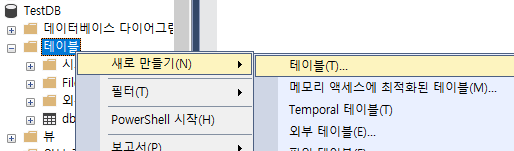

# 날짜, 시간데이터

- #### date

- #### datetime

- #### datetime2

- #### datetimeoffset

    - 표준시간대 지원

- #### smalldatetime

- #### time


### 시간대

- 경도 0도에 있는 그리니치 천문대를 기준으로 한 시간차
    - 각 지역의 시간차이
- 그리니치 평균 태양시 = GMT
- 이후 GMT에서 협정세계시 UTC로 대체(국제표준시간)
    - 예) 한국은 UTC에 +9시간


### date 타입

#### 선언 방법

- DECLARE @aaa date; 
    - @aaa는 변수
- SET @aaa = GETDATE();
    - GETDATE는 현재시간 뽑기, 현재시간 뽑아서 @aaa에 SET해라
- SELECT @aaa as 'DATE';
    - @aaa를 뽑아와라

#### 형식

- 기본 문자열 리터럴(문자열) 형식 YYYY-MM-DD
- 길이 = 10자리, 정확도 = 일 기준
- 범위는 0001-01-01 ~ 9999-12-31

### 입력

- .assets/image-20220308213547050.png) - 테이블에서 쿼리 작성

    1. 변수 선언

    2.  변수에 값 세팅

    3. 변수 값을 뽑아오기

- .assets/image-20220308214052376.png)  F5로 실행시 > .assets/image-20220308214121804.png) 


- .assets/image-20220308214207893.png) as '열이름' > .assets/image-20220308214228916.png) 
    - SQL 명령어는 관습적으로 대문자, ;로 씀...
- .assets/image-20220308214936262.png) SET으로 날짜 지정해도 됨 > .assets/image-20220308214951945.png) 


## datetime 형식

### 선언방식

- DECLARE @aaa datetime;
- SET @aaa = GETDATE();
- SELECT @aaa AS 'DATETIME';
    - 연월일 시분초[밀리초(3자리)] 까지 나온다
    - 최소 19자리부터 최대 23자리까지, 정확도 밀리초기준 .000초
    - 1753-01-01 부터 9999-12-31까지

- .assets/image-20220308215226101.png) > .assets/image-20220308215237599.png) 

> 밀리초는 옵션으로 생략할 수 있다. 최소 19자리, 밀리초포함 23자리

## datetime2

- datetime과 유사하나 밀리초 3자리에서 7자리까지 > 더 정확한 시간대, 날짜범위도 더 큼

- 19자리부터 27자리까지 .0000000 > 100나노초

    ```sql
    DECLARE @aaa datetime2;
    SET @aaa GETDATE();
    SELECT @aaa AS 'DATETIME2'
    ```

- 범위 00:00:00 ~ 23:59:59.9999999
    - 밀리 = 1000분의 1 / 마이크로 = 백만분의 1 / 나노 = 10억분의 1
    - 1초 = 1,000밀리초 / 1밀리초 = 1,000,000나노초
- .assets/image-20220308220406233.png) > datetime(소숫점자리수 지정 가능) .assets/image-20220308220431558.png) 


## Time

- 기본값 00:00:00
- 기본 리터럴 형식 hh:mm:ss[.nnnnnnn]
- 8자리 ~ 16자리

.assets/image-20220308220901470.png)  > GETDATE를 해도 자동으로 잘라서 출력 .assets/image-20220308220924162.png) 


# SYSDATETIME

> 날짜 시간 데이터 형식, 2008버전 이후 지원

- 기존 GETDATE 함수보다 더 정밀하고 정교한 시간 반환

- SYSDATETIMEOFFSET은 시간대 정보까지 포함해 반환

    > 2200-12-25 09:50:34.1232123 +09:00

```sql
DECLARE @aaa datetime;
SET @aaa = SYSDATETIME();
SELECT @aaa;
```

.assets/image-20220308221246706.png) 

```sql
DECLARE @aaa datetimeoffset;
SET @aaa = SYSDATETIMEOFFSET();
SELECT @aaa;
```

.assets/image-20220308221456248.png) datetimeoffset 형식이여야 시간대까지 정상출력된다


# SQL 데이터베이스 언어

- SQL : Structured Query Language
- 관계형 데이터베이스(RDBMS)를 조작하기 위한 데이터베이스 언어
    - DBMS와 소통하기 위한 언어
- 쿼리를 작성할 DB를 선택을 꼭 해야함

- 쿼리문을 저장하면 sql server management studio 폴더에 .sql 파일로 저장이 된다

## CREATE TABLE

- 테이블을 만들 때 CREATE 
- 개체탐색기로도 만들 수 있다
    -  
- 초보일땐 개체탐색기로 구조를 익히되 나중엔 쿼리창에서 직접 작성할 것
- 테이블을 만드는 것은
    - 테이블 이름, 열의 정보와 이름 결정
    - 열의 데이터 형식 및 제약조건 지정

- 테이블명은 영문, 단수형으로 의미를 알수있게 간결하게 만들 것
    - 접근하기 쉬움
    - 중복되지 않게
- 한 테이블 내 중복된 컬럼명은 없게
- CREATE 문 안에서 ()만 써야함 {}는 X
- 각 컬럼들은 매 줄마다 **, 로 구분하고 마지막은 안한다**.
- CREATE문 마지막은 **세미콜론;** 으로 닫는다

- 컬럼명은 일관성있고 규칙성있게 ( mem_id, mem_name ...)
- 되도록 문자로 시작할 것, 대소문자 구분 X
- **DBMS 예약 키워드는 불허, 굳이 써야할 땐 식별자 사용, 특수문자 _ $ # 사용시 주의**
    - 파이썬에서 함수명은 변수명으로 쓰지 않는 것과 같은 원리
    - 쿼리로 만들때는 경고를 주는데 개체탐색기에서 만들면 별도로 경고 안준다
        - 그래서 되도록 쿼리로 만들 것
        - select로 변수명지으면 자동으로 [select]로 씌워줌(식별자)
            - 식별자 : 'key', "key", [key], \`key`


### 쿼리문

```sql
CREATE TABLE dbo.membeTbl (
	컬럼명1 데이터형식 제약조건(NOT NULL),
	컬럼명2 데이터형식 제약조건
);
```

- dbo. 은 생략해도 자동으로 붙는다 `CREATE TABLE membeTbl`

```sql
CREATE TABLE member_table(
	mem_id varchar(16) PRIMARY KEY,
    mem_name nchar(10) NOT NULL,
    mem_join date (안쓰면 NULL 허용)
);
```

- nchar는 한글이 들어올수도 있을때, id는 영문만쓰일거라 varchar

- PRIMARY KEY 기본키
    - 레코드의 대표값, 레코드를 구별하는 유일값이 저장되는 컬럼
    - 기본키 컬럼은 자동으로 NOT NULL, UNIQUE제약 역시 자동으로 설정

#### DBO. 기본 스키마

- 테이블 생성시 이름앞에 dbo. 기본 스키마가 붙는다
    - 스키마? 데이터베이스에서 개체들을 그룹으로 묶어 관리하는 것
        - dbo. 는 기본스키마


## ALTER TABLE

- 테이블을 변경 및 조작할 때 쓰는 쿼리 ( alter : 변경하다, 고치다 )
- 기존 테이블의 새로운 열을 추가하거나 기존 열을 삭제할 때 ALTER문 사용  
    - 변경할 일 없게 만들면 제일 좋다 / 변경은 생각할 게 많음

#### 열 추가

```SQL
ALTER TABLE dbo.member_table
	ADD mem_point int NULL
GO
```

- ALTER TABLE dbo.member_table 해당 테이블을 변경할거야
- ADD 컬럼명 타입 조건 :  ADD 추가해
- GO 실행해

> 새로 추가된 컬럼은 자동으로 제일 마지막 컬럼이 된다(추가시에 위치 지정 불가)

- 만약 순서를 변경하고 싶다면?
    - 앱이나 쿼리 수준에서 변경, 즉 쿼리로 반환된 열에서 순서를 지정하는게 좋다

.assets/image-20220308225402343.png) 

#### 열 삭제

```sql
ALTER TABLE dbo.member_table
	DROP COLUMN mem_point
GO 써도 되고 안써도 되고
```


#### 개체탐색기에서 ALTER 하는 법

테이블 우클릭 - 디자인

 